# SGJP — Sistema de Gerenciamento da JP Transportes

Sistema web desenvolvido para o gerenciamento operacional da **JP Transportes**, centralizando o controle de usuários, frota, motoristas, clientes, administradoras, tabelas de valores, atendimentos e relatórios gerenciais.

A aplicação foi construída utilizando **Python**, **Flask** e **SQLAlchemy**, seguindo uma arquitetura **MVC em Camadas** (Model • View • Controller + Service), priorizando organização, reutilização de código e separação de responsabilidades.

---

# Autor

**Gabriel Maia de Freitas**

---

# Tecnologias Utilizadas

* Python 3
* Flask
* SQLAlchemy
* Flask-Migrate (Alembic)
* PostgreSQL / SQLite
* Jinja2
* HTML5
* CSS3
* JavaScript
* Arquitetura MVC em Camadas

---

# Funcionalidades

### Autenticação

* Login e Logout
* Controle de sessão
* Perfis de acesso (Administrador, Operador e Leitor)

### Módulos de Cadastro

* Usuários
* Caminhões
* Motoristas
* Administradoras
* Clientes
* Tipos de Serviço
* Tabelas de Valores

### Operação

* Cadastro de Atendimentos
* Cálculo automático de valores pela Tabela de Valores
* Controle de pedágio, horas paradas, horas trabalhadas e patins
* Status operacional e financeiro dos atendimentos

### Relatórios

* Relatório por Caminhão
* Relatório por Motorista
* Relatório por Parceiro (Administradora)
* Indicadores de faturamento e quantidade de atendimentos

### Recursos Gerais

* CRUD completo em todos os módulos
* Filtros dinâmicos reutilizáveis
* Visualização completa dos registros
* Exportação para Excel e PDF
* Ativação e desativação de registros
* Versionamento de Tabelas de Valores

---

# Arquitetura do Projeto

O SGJP utiliza uma arquitetura **MVC em Camadas**, onde cada responsabilidade é isolada em um diretório específico.

```text
app/
│
├── models/          # Entidades e relacionamentos
├── routes/          # Controllers (Blueprints)
├── services/        # Regras de negócio
├── filters/         # Configuração dos filtros
├── exports/         # Exportação Excel / PDF
├── templates/       # Views (Jinja2)
├── static/
│   ├── css/
│   └── js/
│
├── constants/
└── utils/

migrations/
tests/
run.py
README.md
```

---

# Instalação

Clone o repositório:

```bash
git clone https://github.com/SEU-USUARIO/SGJP.git
cd SGJP
```

Crie o ambiente virtual:

```bash
python -m venv .venv
```

### Windows

```bash
.venv\Scripts\activate
```

### Linux / macOS

```bash
source .venv/bin/activate
```

Instale as dependências:

```bash
pip install -r requirements.txt
```

---

## Banco de Dados

Aplique as migrations:

```bash
flask db upgrade
```

Para criar o usuário administrador:

```bash
python seed.py
```

---

# Executando a Aplicação

Inicie o servidor:

```bash
python run.py
```

Acesse a aplicação em:

```text
http://localhost:5000
```

---

# Estrutura dos Módulos

| **Módulo**         | **Descrição**                                |
| ------------------ | -------------------------------------------- |
| Usuários           | Controle de acesso e permissões              |
| Caminhões          | Gerenciamento da frota de veículos           |
| Motoristas         | Controle de documentos e validade            |
| Administradoras    | Empresas responsáveis pelos atendimentos     |
| Clientes           | Clientes vinculados às administradoras       |
| Tipos de Serviço   | Categorias de serviços prestados             |
| Tabelas de Valores | Valores por administradora e tipo de serviço |
| Atendimentos       | Controle operacional completo dos serviços   |
| Relatórios         | Indicadores e consultas gerenciais           |

---

## Deploy

O SGJP possui configuração para execução em ambiente de produção utilizando Docker e PostgreSQL.

```bash
docker compose up -d
docker compose exec web flask db upgrade
docker compose exec web python seed.py
```

A documentação completa encontra-se em `DEPLOY.md`.

---

# Capturas de Tela

## Login

Tela de autenticação com controle de acesso por perfil.

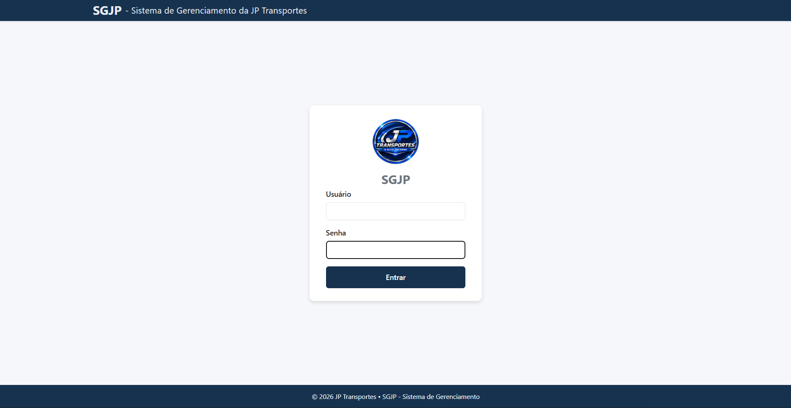

---

## Dashboard

Visão geral do sistema com indicadores operacionais, faturamento e comparação entre períodos.

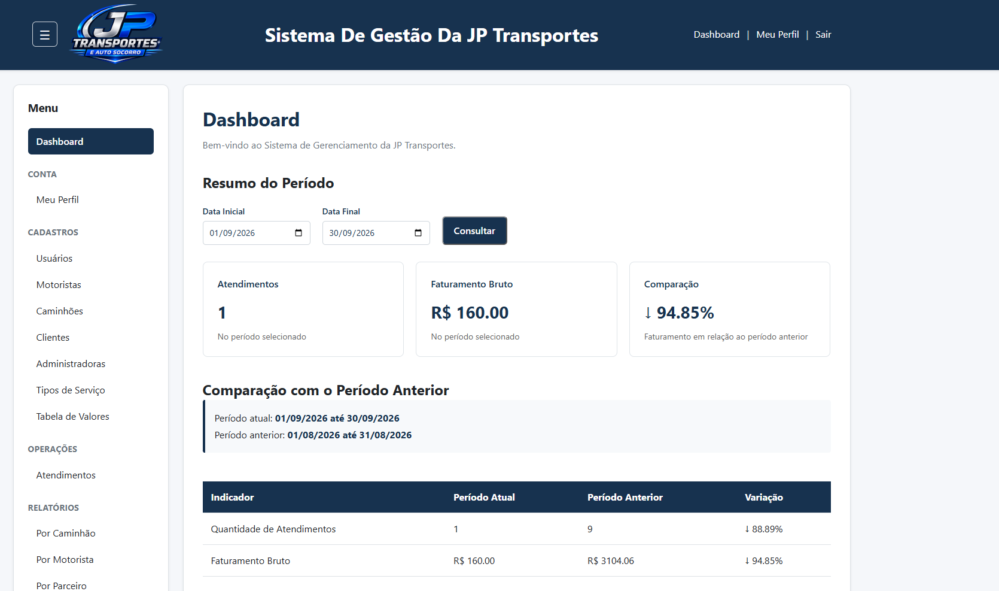

---

## Gerenciamento de Usuários

CRUD completo de usuários com cadastro, edição, ativação/desativação, visualização completa e exportação.

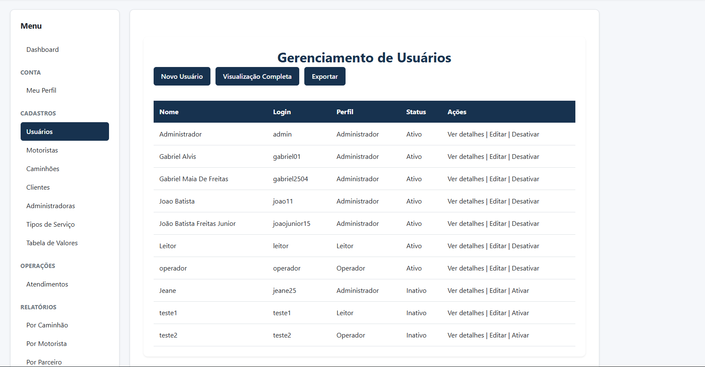

---

## Gerenciamento de Caminhões

Controle da frota de veículos cadastrados.

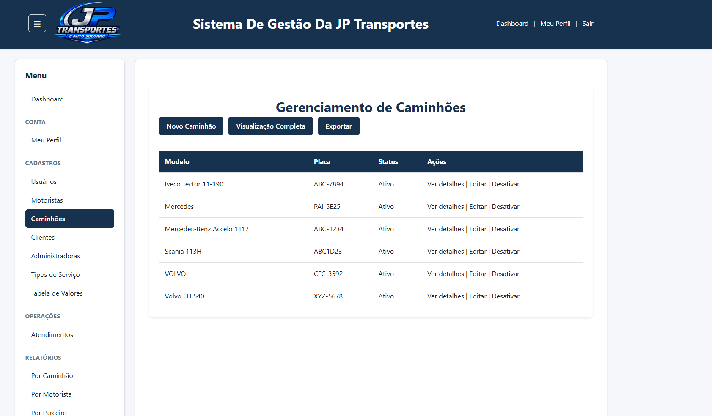

---

## Gerenciamento de Motoristas

Visualização completa dos motoristas com filtros dinâmicos e controle de documentos.

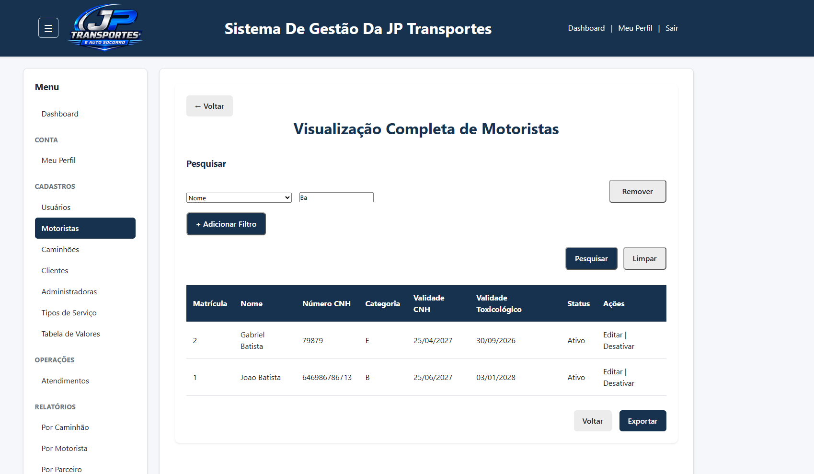

---

## Gerenciamento de Administradoras

Cadastro e gerenciamento das administradoras responsáveis pelos atendimentos.

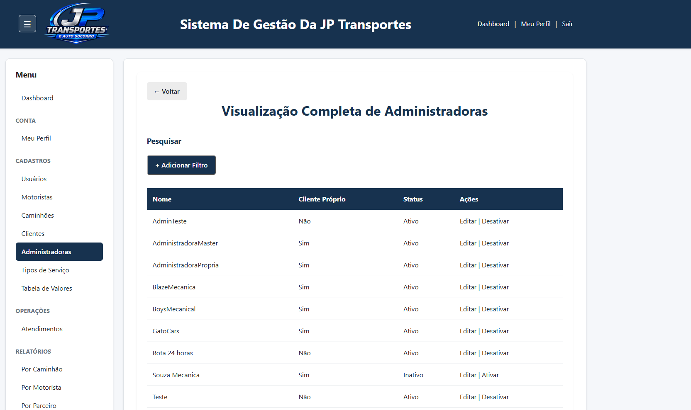

---

## Gerenciamento de Clientes

Cadastro de clientes integrado às administradoras.

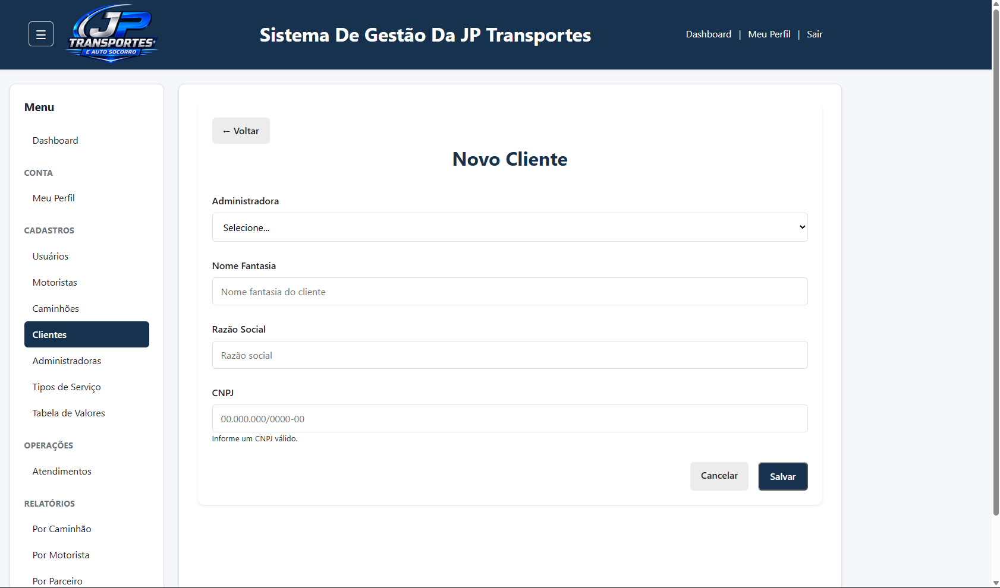

---

## Gerenciamento de Tipos de Serviço

Organização dos tipos de serviço utilizados pela operação.

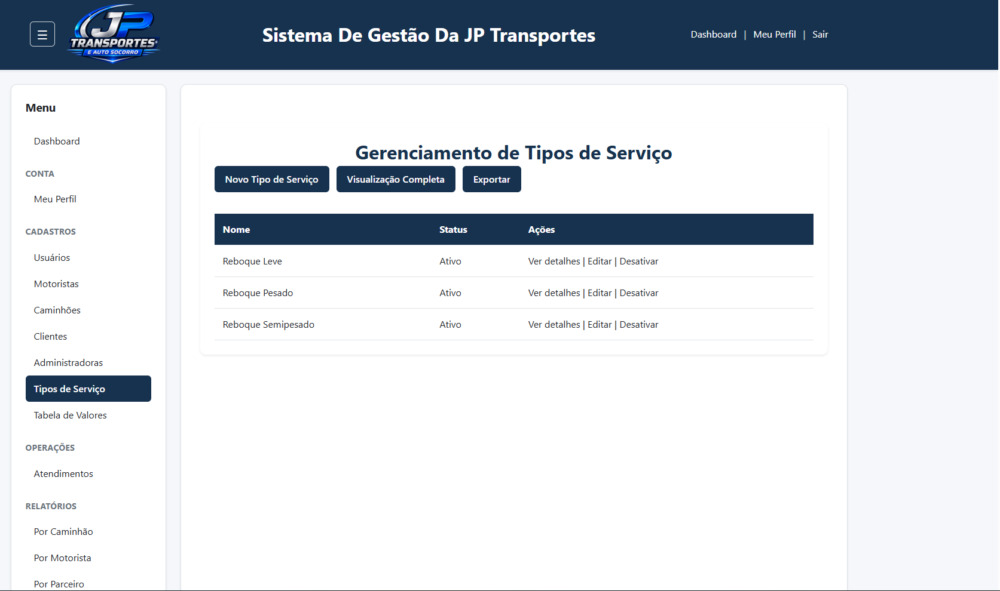

---

## Tabelas de Valores

Versionamento de valores por administradora e tipo de serviço, preservando o histórico das alterações.

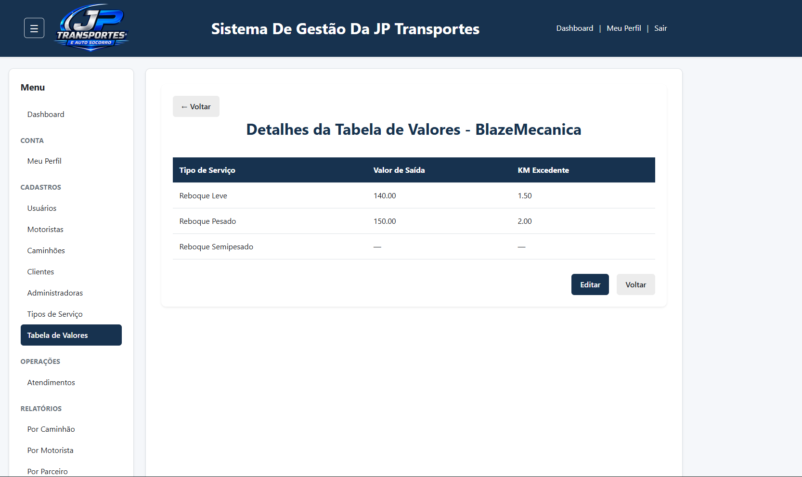

---

## Atendimento — Cadastro

Principal formulário operacional do sistema, responsável pela criação dos atendimentos e cálculo automático dos valores do serviço.

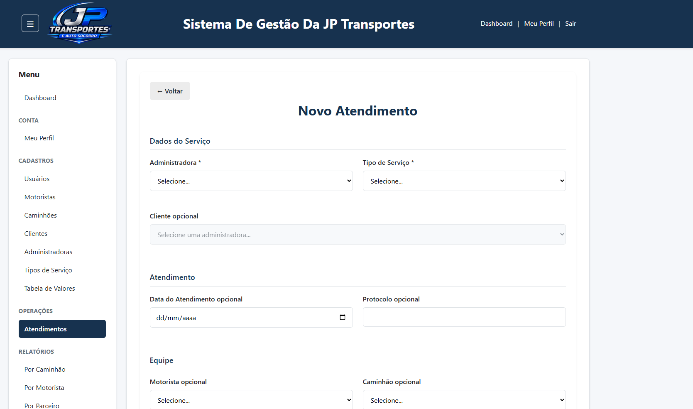
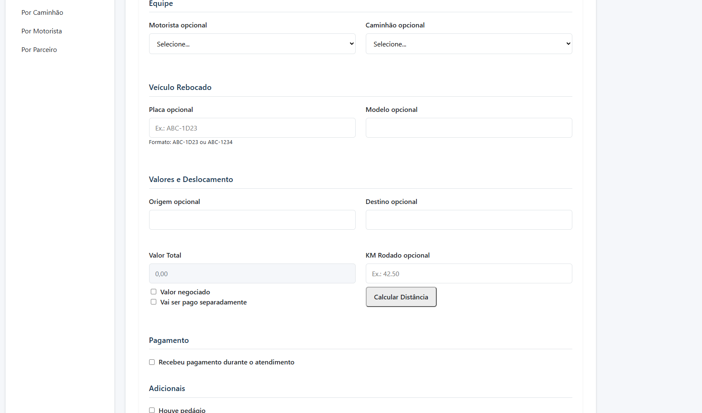
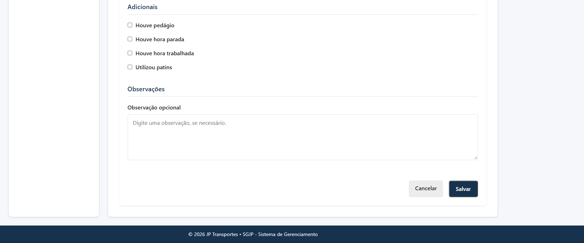

---

## Atendimento — Detalhes

Consulta de atendimentos com filtros avançados, status operacional e financeiro, permitindo localizar rapidamente qualquer atendimento.

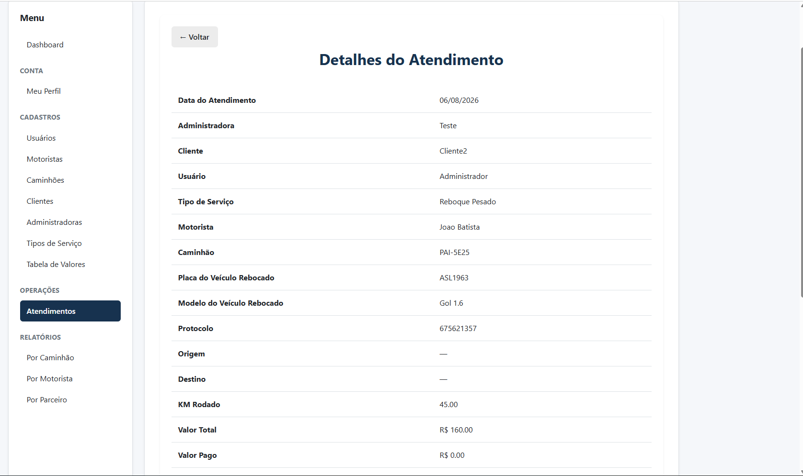

---

## Relatório por Parceiro

Relatório gerencial consolidando faturamento e quantidade de atendimentos por administradora, permitindo análise de desempenho dos parceiros.

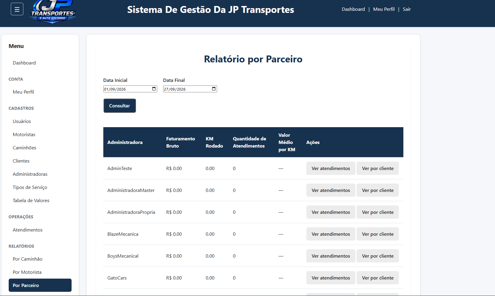

---

## Exportação de Dados

Exportação padronizada dos módulos para Excel e PDF, preservando filtros e colunas selecionadas.

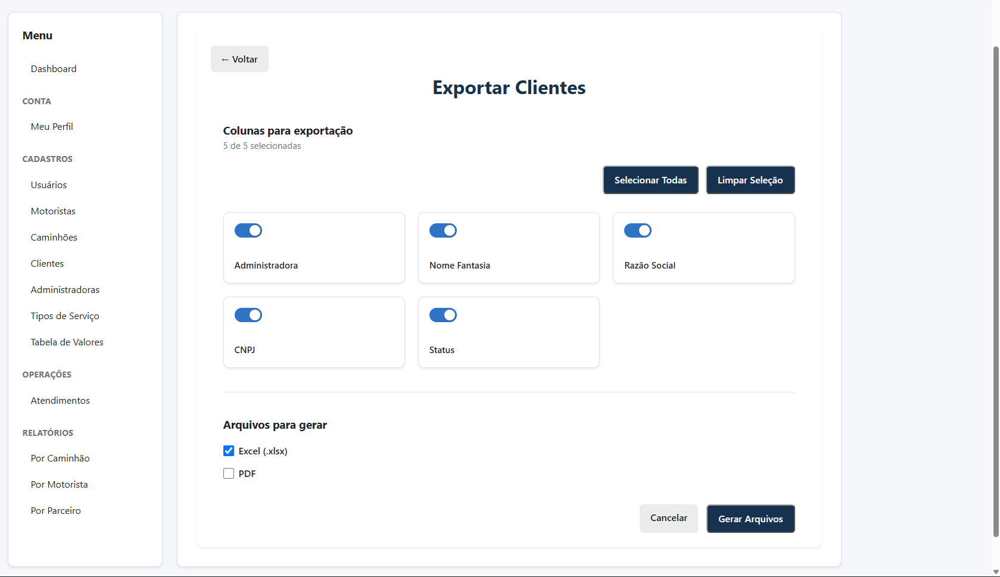

---

# Diferenciais do Projeto

* Arquitetura **MVC em Camadas** com separação clara de responsabilidades.
* Camada de **Services** para centralização das regras de negócio.
* Sistema de filtros reutilizável entre todos os módulos.
* Exportação padronizada para **Excel** e **PDF**.
* Versionamento de tabelas de valores preservando histórico.
* Relatórios gerenciais por caminhão, motorista e parceiro.
* Relacionamentos utilizando **SQLAlchemy** com `back_populates`.
* Interface modular desenvolvida com **Jinja2**, HTML, CSS e JavaScript.

---

# Status do Projeto

**Em desenvolvimento**

Próximas implementações:

* Dashboard operacional avançado.
* Controle de fechamento e pagamentos.
* Comissão de motoristas.
* Correções de pquenos bugs.
* Melhoria no UX do usuário.

---

# Licença

## Licença

Projeto desenvolvido por Gabriel Maia de Freitas como sistema de gerenciamento para a JP Transportes, sendo também utilizado como projeto acadêmico no Instituto Federal de Goiás (IFG) – Campus Anápolis.
